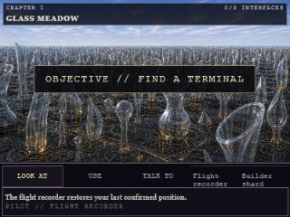
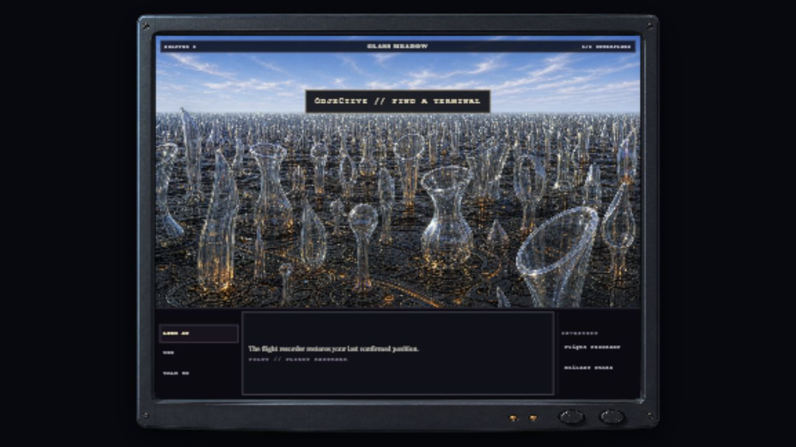

# Glass Meadow CRT accessibility review

## Final verdict

**PASS - all three P2 CRT findings are resolved.** The responsive threshold now chooses the compact authored layout before the canonical bezel would shrink critical content, the narrow presentation has no bezel dimensions and fits the native host exactly, and every enabled command-panel control meets the 24 px minimum target benchmark. No runtime or raster change was needed during this re-review.

This remains a bounded source, test, current-capture, and supplied in-app-browser evidence review rather than a WCAG-conformance claim.

## Numbered re-review

1. **Readable 640 x 480 scaling - healthy.** Hosts below 760 x 596 select the 320 x 240 authored layout. At 640 x 480 it renders at 1.983x instead of shrinking the canonical interface to 0.797x. Narrow 8 logical px control labels therefore render at about 15.9 CSS px, and the compact frame remains inside the viewport.
2. **Native 320 x 240 containment - healthy.** Narrow bezel widths are all zero; the logical stage and playfield are both exactly 320 x 240 at 1x. Current in-app-browser geometry is `{left:0, top:0, right:320, bottom:240}`, so the prior `y=-1` content clip is gone. The current capture shows the complete top status strip, world band, command row, dialogue, and bottom edge.  
   
3. **Required scene-control targets - healthy.** LOOK AT, USE, TALK TO, Flight Recorder, and Builder Shard each render 24 px high at 320 x 240, with measured widths from 52 to 67 px. At 1280 x 720 all five render 29.2 px high. CSS establishes `min-width:24px` and `min-height:24px`; E2E now rejects any enabled command button below either threshold.  
   

## Preserved contracts

- Meadow hotspots and first-Terminal choices remain at least 44 px.
- Meadow-entry focus, verb keyboard selection, named hotspots, Terminal title focus, inert background, Tab/Shift+Tab containment, Escape closure, and trigger restoration are unchanged.
- The decorative canonical bezel stays outside the playfield, is non-focusable, and adds no motion. Narrow hosts omit it rather than sacrificing content.
- Reduced-motion CSS continues to disable smooth scrolling.

## Validation

- Current 1280 x 720 and 320 x 240 captures inspected at original resolution.
- Focused frame/Terminal tests: 7/7 passed during this re-review.
- Current relay evidence: unit suite 169/169 passed; production build passed; updated E2E target assertions passed through credits in 120 seconds.
- Static source review confirmed the 760 x 596 compact threshold, zero narrow bezel dimensions, 1.983x 640 x 480 compact scale, 320 x 240 exact stage, 24 px CSS minima, and E2E `minControlWidth` / `minControlHeight` enforcement.
- Human NVDA, physical switch-control, forced-colors, and 200% zoom checks remain outstanding before any accessibility-conformance claim.

## Handoff

The CRT presentation is cleared for integration. Preserve the compact threshold, exact native containment, command-control minima, and E2E measurements alongside the existing focus and 44 px primary-target contracts.

## Status

`PASS - all three CRT P2 findings resolved`
