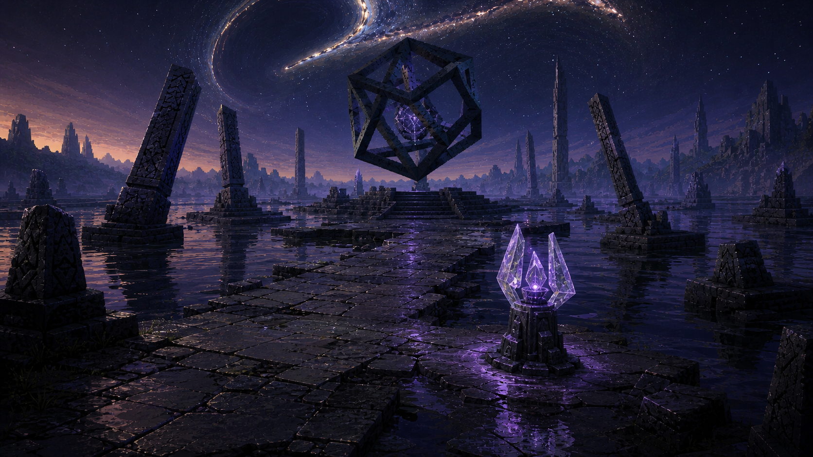

# Horizon Archive Concept Art Book

This is the spoiler-safe visual production atlas for the places a player can visit. It translates surface canon into playable environment plates without defining the Builders' disappearance, the Machine, or any unreleased answer.

## Start here

- [Art-direction charter](art-direction-charter.md)
- [Planet and region map](planet-region-map.md)
- [Scene index](scene-index.md)
- [Scene-sheet template](scene-sheet-template.md)
- [Prompt and provenance log](prompt-provenance-log.md)
- [Location Scout work log](WORK_LOG.md)

## Selected plates

Production notes: [GM-00 — Glass Meadow Landing Shelf](scenes/GM-00-glass-meadow-landing-shelf.md).

Production notes: [AB-01 — Drowned Archive Workload Terminal](scenes/AB-01-drowned-archive-workload-terminal.md).

## Spoiler boundary

All names in this book are pilot-facing survey labels or neutral production IDs. A scene may pose a question through environment and scale, but it may not answer the central mystery. The hidden-lore vault is outside this book's source set.
