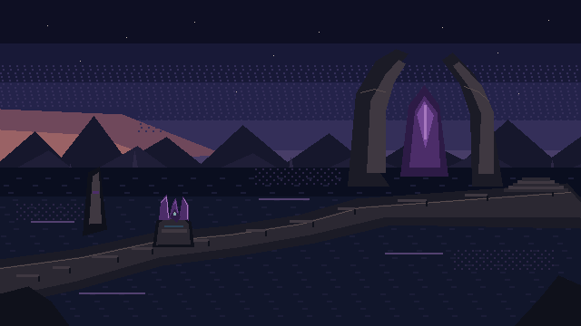

# AB-01 Drowned Archive — Production Pixel Package

## Delivery

- **Coder implementation asset:** `Concept Art Book/production-pixel/AB-01/ab01-available-640x360.png`
- **Logical size:** exactly `640 x 360` square pixels for the world region of the canonical `640 x 480` canvas.
- **Authorship:** [build_ab01_pixel.py](build_ab01_pixel.py) draws integer rectangles, polygons, and 1–2 px lines from an explicit 32-color library. It does not load, sample, trace, resize, or filter concept art.
- **1x inspection:** [available world](ab01-available-640x360.png)
- **Nearest-neighbor 2x:** [1280 x 720 QA](qa/ab01-available-2x-1280x720.png)
- **Palette:** [32 swatches](qa/palette-swatches-32.png)
- **States:** [1x strip](qa/terminal-state-strip-1x.png) · [2x strip](qa/terminal-state-strip-2x.png)
- **Canonical framing:** [measured 640×480 available/complete study](CANONICAL_FRAME.md)
- **Responsible AI motif:** [four-group physical Terminal package](responsible-ai/README.md)
- **Model/deployment motif:** [three rings and two-part decision/reason core](model-deployment/README.md)
- **Structured Packets motif:** [three nested sockets and continuous groove](structured-packets/README.md)
- **Control Flow motif:** [inlet, repeated loop, equality fork, append path, and outlet](control-flow/README.md)
- **Offline Client Bridge motif:** [five stations, empty keyed secret socket, and one-way trace](offline-client/README.md)
- **Text Analysis motif:** [four analysis apertures, correlation rail, and split returns](text-analysis/README.md)
- **Speech Workloads motif:** [recognition, synthesis, multimodal, and cancellation strip](speech-workloads/README.md)
- **Information Extraction motif:** [four modalities, schema lattice, null, evidence/value, and rejection](information-extraction/README.md)
- **Portal Orientation motif:** [eight checkpoints, catalog/deployment distinction, empty credential, and cleanup lock](portal-orientation/README.md)

## Originality gate

Retained abstract traits only: flooded quiet, violet/peach mood, monumental scale, dry route, grounded three-fin Terminal. Replaced concrete forms and layout with an original upper-right split Tidal Lens, suspended lozenge, left-entry bent causeway, left-middle Terminal, and right stair exit. The earlier smooth plate is exploration-only.

## Geometry

| Element | Logical contract |
|---|---|
| World | `x=0, y=0, w=640, h=360` |
| UI reservation | separate `x=0, y=360, w=640, h=120` |
| Required walk strip | causeway stays within `y=214–338` |
| Terminal overlay anchor | `x=156, y=211`; overlay `64 x 64` |
| Terminal painted bounds | approximately `x=168–213, y=215–272`; 45 x 57 px |
| Terminal hit box | `x=156, y=205, w=68, h=76` |
| Landmark | approximately `x=383–553, y=54–205` |
| Exit | right stair, approximately `x=555–639, y=196–223` |
| Low-detail target pocket | `x=40–330, y=170–350`, about 22.7% |
| Foreground masks | about 7.5%; no route/target/exit overlap |

The hit box exceeds 44 x 44 at 1x and yields 136 x 152 CSS pixels at 2x.

## Terminal state overlays

Transparent `64 x 64` assets under [states/](states/) change geometry and value, never color alone:

- **Dormant:** closed fins, asymmetric notch, absent beacon.
- **Available:** open three-fin silhouette, exposed seam, stable 3 x 3 beacon.
- **Active:** split beacon positions, contact line, bright seam.
- **Complete:** aligned fins, closed route ring, extended marker.

Full `640 x 360` composites for all four states are included. Reduced motion uses the same static geometry.

## Palette and cluster audit

- Selected scene uses 27 colors from a 32-color library; materials use 4–6 values; no gradients.
- Actionable contours are selective 1 px; base contact is 2 px; architecture uses value boundaries.
- Surface clusters are 2–8 px. Permitted isolated 1 px marks are stars and the beacon.
- Haze uses bounded 25% ordered dither; water patches stay at or below 12.5%; target/state edges are undithered.

## Pixel Patrol twelve-point handoff

1. **Pass:** native original `640 x 360`; no concept pixels loaded.
2. **Pass:** 27 scene colors; authored value ramps; no gradients.
3. **Pass:** one landmark, one dominant route, two secondary reads.
4. **Pass:** 22.7% low-detail pocket.
5. **Pass:** Terminal 57 x 45 with unique top and >24 luminance-point edge.
6. **Pass:** 1 px contours, 2 px contact, 2–8 px clusters, no invalid orphan noise.
7. **Pass:** bounded haze/water dither only.
8. **Pass:** four states change silhouette and value.
9. **Pass:** painted bounds plus separate 68 x 76 hit box.
10. **Pass:** foreground masks under 18% and clear of required geometry.
11. **Pass:** native/2x renders, swatches, bounds, route, and state strip delivered.
12. **Pass:** abstract traits retained; concrete layout/forms replaced.

Runtime-only checklist items—complete `640 x 480` composition, letterboxing, cursor/actions, input recovery, saves, and no-dead-end behavior—remain for Coder and Player Agent after integration.

The canonical framing study now validates the world/UI arithmetic and quiet-footer geometry as production evidence. Live controls, text, scaling, and behavior remain runtime checks.
