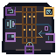

# Offline Capstone Readiness Physical Motif

This native `64 x 64` AB-01 overlay is an implementation mnemonic for L-06-03, not a new location or story event. Three distinct inputs represent client boundaries, directional text/speech work, and structured extraction. They feed one closed evidence lattice with a prerequisite lock, then branch into three physically different outcomes:

- closed socket: ready for the next practice checkpoint
- returning loop: remediate before the checkpoint
- open incomplete socket: insufficient evidence

No outcome guarantees an exam result. No branch authorizes service calls, disclosure, or external action. Shape, value, pattern, continuity, and open/closed mass carry meaning; color only reinforces it and no text is embedded.

## Delivery and placement

- [Native transparent RGBA](capstone-readiness-64x64.png)
- [Exact nearest-neighbor 2x](qa/capstone-readiness-2x-128x128.png)
- [Native grayscale QA](qa/capstone-readiness-grayscale-64x64.png)
- [Combined plus seven component-isolation tiles](qa/component-isolation-2x-1024x128.png)
- [Integer renderer](build_capstone_readiness.py)
- [Acceptance validator](validate_capstone_readiness.py)

Use AB-01 anchor `x=156, y=211` in the `640 x 360` world and retain hotspot `x=156, y=205, w=68, h=76`. The overlay cannot enter the `120 px` interface or quiet footer rows `461-479` of the canonical `640 x 480` composition.

## Accessibility handoff

Persistent live labels are mandatory for all three implementation inputs, prerequisite evidence, every readiness result, remediation destination, and the no-guarantee/no-action boundary. Keyboard status and textual feedback remain authoritative. The motif must not be the sole carrier of readiness, failure, source, or safety information.
