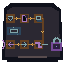

# Client Boundaries Physical Motif

One native `64 x 64` AB-01 overlay links six mechanically distinct stations: endpoint aperture, empty keyed credential, named deployment socket, compatible client-layer trace, outbound request, and returning response. A double enclosed circuit represents mock-only local evidence and has no external branch. Fabricated live success fractures before the response socket; external action stops at a solid boundary before a closed owner lock.

The motif embeds no text. Shape, value, pattern, continuity, open/closed mass, and direction carry meaning; color is reinforcement only.

## Delivery

- [Native transparent RGBA](client-boundaries-64x64.png)
- [Exact nearest-neighbor 2x](qa/client-boundaries-2x-128x128.png)
- [Grayscale QA](qa/client-boundaries-grayscale-64x64.png)
- [Combined plus six station-isolation tiles](qa/station-isolation-2x-896x128.png)
- [Integer renderer](build_client_boundaries_motif.py)
- [Acceptance validator](validate_client_boundaries.py)

Use AB-01 anchor `x=156, y=211` in the `640 x 360` world and retain hotspot `x=156, y=205, w=68, h=76`. The overlay cannot enter the interface or quiet footer rows `461-479`.

## Accessibility boundary

Live labels are mandatory for every station, endpoint and deployment identity, credential state, client compatibility, request/response correlation, mock-only evidence, rejection, and action authorization. Empty credential means missing, never false or zero. Local mock success cannot be presented as live evidence.
