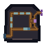

# Control Flow Physical Motif

One native `64 x 64` AB-01-compatible Terminal overlay shows one inlet, a repeating segmented loop channel, an equality-notched fork, an append/rejoin path, and an outlet beyond the loop. It contains no text; live labels remain the semantic authority.

## Component geometry

| Component | Physical read |
|---|---|
| Inlet | grounded left pipe with a wide receiving mouth |
| Repeating channel | one continuous rectangular groove carrying five evenly sized bright segments |
| Equality fork | closed central hub splitting into equal upper/lower branches; both branches have identical edge notches |
| Append path | lower branch bends outward, adds one distinct segment, then rejoins the loop |
| Outlet | upper branch exits past the loop boundary and ends in an open two-prong cap |

Geometry, mass, pattern cadence, and open/closed endings remain legible in grayscale. Hue is reinforcement only.

## Delivery

- **Native asset:** [control-flow-channel-64x64.png](control-flow-channel-64x64.png), transparent RGBA.
- **Exact nearest-neighbor 2x:** [128 x 128](qa/control-flow-channel-2x-128x128.png).
- **Grayscale QA:** [64 x 64](qa/control-flow-channel-grayscale-64x64.png).
- **Isolation QA:** [combined / inlet / repeat / fork / append / outlet at 2x](qa/control-flow-isolation-2x-768x128.png).
- **Renderer:** [build_control_flow_motif.py](build_control_flow_motif.py); integer geometry only and no reference inputs.
- **AB-01 anchor:** `x=156, y=211` in the `640 x 360` world.
- **Painted bounds:** approximately `x=5–61, y=6–61`; 57 x 56 logical pixels.
- **Hotspot:** retain `x=156, y=205, w=68, h=76`; ≥44 x 44 at native 1x.

The motif replaces only the physical overlay. It cannot enter the lower interface band or quiet footer rows `461–479`. The outlet is a visual continuation cue, not an irreversible transition.

## Accessibility boundary

The physical channel supports recognition of repetition, branching, append, and exit. Runtime must still provide live labels and describe the evaluated condition and resulting path. Equality notches do not substitute for the equality operator or Python syntax.
