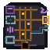

# Information Extraction Physical Motif

One native `64 x 64` AB-01-compatible overlay presents document/form, image, audio, and video apertures feeding a schema lattice. Null is an intentionally empty keyed socket; extracted value and evidence/confidence use separate channels; an invented-value spur breaks before output. It embeds no text.

## Physical language

| Function | Geometry/pattern |
|---|---|
| Document/form | square with one long slot and two form cells |
| Image | four open locator corners around a center pixel |
| Audio | three unequal vertical pulse bars |
| Video | doubled square frame with two edge sprocket notches |
| Schema lattice | three vertical rails crossed by four extraction-slot rails |
| Null/missing | empty bottom socket with asymmetric keyed notch |
| Extracted value | single solid right channel ending in a closed filled socket |
| Evidence/confidence | separate paired return rails with two unequal end blocks |
| Invented value | upper spur separated from an isolated stepped fracture by a hard gap |

Shape, pattern, continuity, and open/closed mass remain distinguishable in grayscale. Color is reinforcement only.

## Delivery

- **Native asset:** [information-extraction-lattice-64x64.png](information-extraction-lattice-64x64.png), transparent RGBA.
- **Exact nearest-neighbor 2x:** [128 x 128](qa/information-extraction-lattice-2x-128x128.png).
- **Grayscale QA:** [64 x 64](qa/information-extraction-lattice-grayscale-64x64.png).
- **Isolation QA:** [combined plus nine components at 2x](qa/component-isolation-2x-1280x128.png).
- **Renderer:** [build_information_extraction_motif.py](build_information_extraction_motif.py); integer geometry only and no reference inputs.
- **AB-01 anchor:** `x=156, y=211` in the `640 x 360` world.
- **Painted bounds:** approximately `x=4–62, y=3–62`; 59 x 60 logical pixels.
- **Hotspot:** retain `x=156, y=205, w=68, h=76`; ≥44 x 44 at native 1x.

The motif replaces only the physical overlay. It cannot enter the lower interface band or quiet footer rows `461–479`.

## Accessibility boundary

Live labels and text equivalents remain mandatory for every modality, field, null, extracted value, evidence/confidence, and rejection result. The empty socket means missing/unsupported, not zero or false. Physical rejection does not replace a textual explanation of why invented evidence is invalid.
