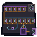

# SIM-01 Mixed Simulation Physical Motif

This native `64 x 64` AB-01 overlay is a learner-facing implementation mnemonic for SIM-01, not exam content and not a new location. Twelve split sockets preserve the decision/reason pair for every item. Five sockets form the first domain bank and seven form the second; one ordered trace joins both banks without implying that averages can hide an individual miss.

The optional timer is physically detached from the mastery trace. A missed boundary returns through a remediation loop. Independent cumulative retention remains a closed keyed gate. Exam guarantees, disclosure, service calls, and external or destructive action terminate at an open blocked exit. Shape, value, pattern, continuity, and open/closed mass carry meaning; color is reinforcement only and no text is embedded.

## Delivery and placement

- [Native transparent RGBA](mixed-simulation-64x64.png)
- [Exact nearest-neighbor 2x](qa/mixed-simulation-2x-128x128.png)
- [Native grayscale QA](qa/mixed-simulation-grayscale-64x64.png)
- [Combined plus seven component-isolation tiles](qa/component-isolation-2x-1024x128.png)
- [Integer renderer](build_mixed_simulation.py)
- [Acceptance validator](validate_mixed_simulation.py)

Use AB-01 anchor `x=156, y=211` in the `640 x 360` world and retain hotspot `x=156, y=205, w=68, h=76`. It cannot enter the `120 px` interface or quiet footer rows `461-479` of the canonical `640 x 480` square-logical-pixel composition.

## Accessibility handoff

Persistent text must identify item position, both dimensions, objective routes, five/seven domain distribution, timing state, remediation destination, cumulative-retention status, and the no-exam-guarantee/no-action boundary. Timer state must never rely on urgency color, animation, or countdown pressure. Focus, status text, and one-card reading order remain runtime authority.
