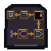

# Offline Client Bridge Physical Motif

One native `64 x 64` AB-01-compatible Terminal overlay presents five square stations—module, file, secret, request, response—joined by a one-way snake trace. It embeds no text; live labels remain the semantic authority.

## Station geometry

| Station | Non-text construction |
|---|---|
| Module | nested square socket with a compact center block |
| File | square socket with a stepped upper rail and lower slot |
| Secret | empty square socket with an asymmetric inward key notch; no interior symbol or value mass |
| Request | inward-facing five-point channel profile |
| Response | mirrored outward-facing channel profile |

The trace runs module → file → secret → request → response, then ends in an open split cap beyond the response. Repeated directional teeth point right, right, down, left, left. Direction therefore survives grayscale and does not depend on hue.

## Delivery

- **Native asset:** [offline-client-bridge-64x64.png](offline-client-bridge-64x64.png), transparent RGBA.
- **Exact nearest-neighbor 2x:** [128 x 128](qa/offline-client-bridge-2x-128x128.png).
- **Grayscale QA:** [64 x 64](qa/offline-client-bridge-grayscale-64x64.png).
- **Isolation QA:** [combined / module / file / secret / request / response / trace at 2x](qa/station-trace-isolation-2x-896x128.png).
- **Renderer:** [build_offline_client_motif.py](build_offline_client_motif.py); integer geometry only, no reference inputs.
- **Approval validator:** [validate_offline_client_motif.py](validate_offline_client_motif.py).
- **AB-01 anchor:** `x=156, y=211` in the `640 x 360` world.
- **Painted bounds:** `x=5–59, y=5–61`; 55 x 57 logical pixels.
- **Hotspot:** retain `x=156, y=205, w=68, h=76`; ≥44 x 44 at native 1x.

The motif replaces only the physical overlay. It never enters the lower interface band or quiet footer rows `461–479`. The keyed tooth now uses a one-pixel stem to reach the socket's top trace boundary while leaving at least 60 of its 81 interior pixels empty.

## Accessibility boundary

Geometry distinguishes the five stations and indicates trace direction, but cannot safely name a module, filename, environment secret, request, or response. Runtime must expose persistent live labels and describe that secret values are supplied securely rather than authored into source. The empty socket intentionally depicts absence; it does not reveal or store a secret.
