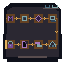

# Portal Orientation Physical Motif

One native `64 x 64` AB-01 overlay uses a continuous serpentine rail and eight mechanically distinct sockets: split access gate, nested project frame, faceted model core, closed deployment socket with name-tab, graduated readiness gauge, opposing interaction prongs, empty keyed connection-detail credential slot, and owner-locked cleanup socket against a terminal cap.

The detached two-bin shelf above checkpoint four is the catalog. Its collection geometry is physically separate from the individually addressable deployment socket. There is no embedded text; shape, value, pattern, continuity, and open/closed mass carry meaning, with color only reinforcing it.

## Delivery

- [Native transparent RGBA](portal-orientation-64x64.png)
- [Exact nearest-neighbor 2x](qa/portal-orientation-2x-128x128.png)
- [Grayscale QA](qa/portal-orientation-grayscale-64x64.png)
- [Combined plus eight checkpoint isolation tiles](qa/checkpoint-isolation-2x-1152x128.png)
- [Integer renderer](build_portal_orientation_motif.py)
- [Acceptance validator](validate_portal_orientation.py)

Use AB-01 anchor `x=156, y=211` in the `640 x 360` world and retain hotspot `x=156, y=205, w=68, h=76`. The overlay cannot enter the lower interface or quiet footer rows `461-479`.

## Accessibility boundary

Live labels remain mandatory for every checkpoint, catalog versus deployment, credential state, resource owner, and cleanup consequence. Empty credential means missing or unsupplied, never false or zero. Runtime teaching must identify the owner and require confirmation before cleanup.
