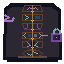

# Prompt Layers Physical Motif

One native `64 x 64` AB-01 overlay uses a continuous evaluation spine and six mechanically distinct layers: crowned system envelope, open user inlet, rooted grounding bed, bracketed output contract, split conflict/no-authority boundary, and faceted evaluation return.

A jagged injection side spur stops across a hard gap before the user layer. A request line approaches the external action socket but terminates at a solid boundary before its closed owner lock. The prompt assembly therefore cannot visually imply action authority. There is no embedded text; shape, value, pattern, continuity, and open/closed mass carry meaning, with color only reinforcing it.

## Delivery

- [Native transparent RGBA](prompt-layers-64x64.png)
- [Exact nearest-neighbor 2x](qa/prompt-layers-2x-128x128.png)
- [Grayscale QA](qa/prompt-layers-grayscale-64x64.png)
- [Combined plus six layer-isolation tiles](qa/layer-isolation-2x-896x128.png)
- [Integer renderer](build_prompt_layers_motif.py)
- [Acceptance validator](validate_prompt_layers.py)

Use AB-01 anchor `x=156, y=211` in the `640 x 360` world and retain hotspot `x=156, y=205, w=68, h=76`. The overlay cannot enter the lower interface or quiet footer rows `461-479`.

## Accessibility boundary

Live labels are mandatory for every layer, source and authority state, injection rejection, conflict outcome, contract violation, and evaluation result. Runtime teaching must explain that instructions cannot manufacture permissions and must name the external owner or confirmation needed before any action.
