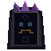

# Responsible AI Physical Terminal Motif

This original AB-01-compatible physical node represents the learner's required reasoning order without baked words, letters, numerals, or familiar app icons.

## Delivery

- **Native motif:** [responsible-ai-terminal-available-64x64.png](responsible-ai-terminal-available-64x64.png), transparent `64 x 64` RGBA.
- **Nearest-neighbor QA:** [128 x 128](qa/responsible-ai-terminal-available-2x-128x128.png).
- **Progress sequence:** [1x](qa/responsible-ai-sequence-1x-320x64.png) · [2x](qa/responsible-ai-sequence-2x-640x128.png).
- **Exercise frame modes:** [primary → transfer → explanation specification](FRAME_MODES.md).
- **Renderer:** [build_responsible_ai_terminal.py](build_responsible_ai_terminal.py); integer shapes only, no reference assets loaded.
- **AB-01 anchor:** `x=156, y=211` in the `640 x 360` world, reusing the existing Terminal quiet pocket.
- **Painted bounds:** approximately `x=9–56, y=1–61` inside the overlay; 48 x 61 logical pixels.
- **Hotspot:** existing AB-01 `x=156, y=205, w=68, h=76`, safely above 44 x 44 at 1x.

## Four ordered indicator groups

| Vertical order | Meaning | Non-text geometry | Completed change |
|---|---|---|---|
| 1 | Principle | one faceted diamond | hollow center becomes a filled value mass |
| 2 | Stakeholder | two separated party blocks | a central bridge joins the parties |
| 3 | Mitigation | broken stepped intervention path | middle block closes the path |
| 4 | Accountable owner | bounded owner square | owner fills and gains a stem anchored to the base |

The sequence QA advances one group at a time from top to bottom. Every step changes shape and value, not color alone. Indicators are undithered and separated by at least three quiet logical rows.

## Location and footer contract

The motif replaces only the physical Terminal overlay within AB-01; it does not alter the Tidal Lens, causeway, route, exit, or lore. It occupies world rows below 360 and never enters interface framing. When its exercise opens, canonical rows `461–479` remain the flat quiet help-footer zone defined in [AB-01 canonical framing](../CANONICAL_FRAME.md).

## Originality and legibility

The crown follows Horizon Archive's established three-fin Machine family. The stacked diamond, paired parties, intervention bridge, and anchored owner are new project geometry and do not reproduce reference-game assets or UI. At native 1x, the read order is crown → four stacked groups → grounded base; at 2x, every pixel is an exact 2 x 2 square.
