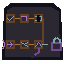

# Single-Agent Physical Motif

One native `64 x 64` AB-01 overlay links six shape-distinct stations for fit, instructions, least-privilege tools, test, denial/failure, and client flow. Tool permissions use an empty asymmetric keyed shutter. The denied or timed-out branch remains visibly incomplete; fabricated success fractures before client flow; external action stops behind a separate owner lock.

Deliveries: [exact 2x](qa/single-agent-2x.png), [grayscale](qa/single-agent-gray.png), [station isolation](qa/station-isolation-2x.png), and [integer renderer](build_single_agent.py). Use AB-01 anchor `x=156, y=211` and hotspot `x=156, y=205, w=68, h=76`; never enter the interface or footer rows `461-479`.

Live labels remain mandatory for fit, instruction source, every tool permission, tests, denial versus timeout, client correlation, rejection, and external authorization. Geometry never grants authority or proves success.
